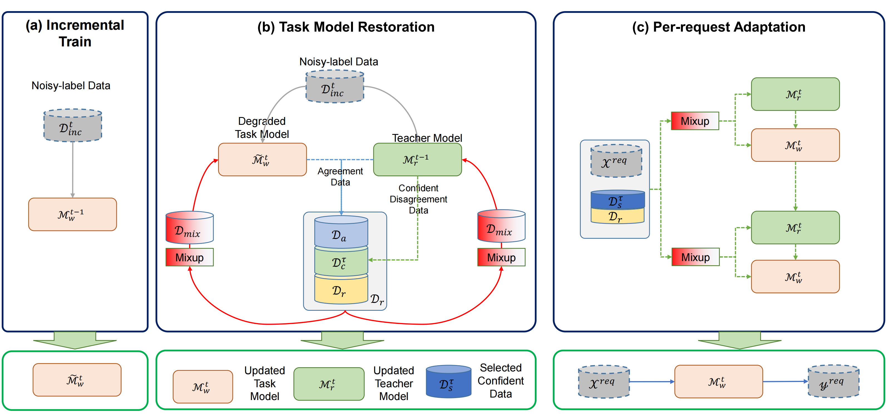

# CONTRA: A Continual Restoration and Adaptation Learning Framework for Ever-robust Online Image Recognition and Search

<div align="center">

 [:sparkles: Overview](#sparkles-overview) | [:computer: Usage](#computer-usage) | [:link: License](#scroll-license)

<div align="left">

<!-- ADD WARNING: Only the core code is retained. If needed, we can provide Jupyter notebooks for baseline reproduction and result analysis, as well as pre-trained models. -->
## :sparkles: Overview

<!-- insert the pdf of framework from assets/framework.pdf -->
</img>

This repository provides a framework for noise-robust training and incremental learning with datasets such as CIFAR-10, CIFAR-100, and Oxford-IIIT Pet (PET-37). The project demonstrates robust model training under various noisy label conditions and supports multiple training modes, including raw training and incremental training.

## :computer: Usage

### :rainbow: Create Environment

Create and activate a virtual environment with the required dependencies:

```bash
conda create -n ${env_name} -r requirements.txt
conda activate ${env_name}
```

### :rocket: Prepare Dataset

#### :zap: Supported Datasets

This project supports the following datasets:

1. **CIFAR-10**:
   - A dataset containing 60,000 32x32 color images in 10 classes, with 6,000 images per class.
   - Directory structure:
     - `data/cifar-10/normal/`: Contains the original dataset.
     - `data/cifar-10/gen/`: Stores generated datasets with noise.

2. **CIFAR-100**:
   - A dataset containing 60,000 32x32 color images in 100 classes, grouped into 20 superclasses.
   - Directory structure:
     - `data/cifar-100/normal/`: Contains the original dataset.
     - `data/cifar-100/gen/`: Stores generated datasets with noise.

3. **Oxford-IIIT Pet (PET-37)**:
   - A dataset containing 37 categories of pet images with approximately 200 images per category.
   - Directory structure:
     - `data/pet-37/normal/oxford-pets/`: Contains the original dataset.
     - `data/pet-37/gen/`: Stores generated datasets with noise.

#### :zap: Generate Noisy Dataset

You can generate datasets with symmetric or asymmetric label noise for any supported dataset by running the provided scripts.

**Example command for CIFAR-100 (symmetric noise):**

```bash
PYTHONPATH=${code_base} python gen_dataset/gen_cifar100_exp_data.py \
--data_dir ./data/cifar-100/normal \
--gen_dir ./data/cifar-100/gen/ \
--noise_type symmetric \
--noise_ratio 0.2 \
--num_versions 3 \
--retention_ratios 0.5 0.3 0.1 \
--balanced
```

**Replace `--data_dir` and `--gen_dir` with paths for CIFAR-10 or PET-37 as needed.**

### :fire: Training Models

#### :zap: Training Modes

The framework supports the following training modes across all datasets:

1. **Raw Training**: Train models on datasets with no incremental steps.

**Example command for CIFAR-100:**

```bash
CUDA_VISIBLE_DEVICES=${CUDA_DEVICE_NUM} python run_experiment.py \
--step -1 \
--model cifar-wideresnet40 \
--dataset cifar-100 \
--noise_ratio 0.2 \
--noise_type symmetric \
--balanced \
--epoch 200 \
--learning_rate 0.05 \
--optimizer adam \
--batch_size 256
```

2. **Incremental Training**: Train models incrementally on noisy datasets.

**Example commands for CIFAR-10 (symmetric noise):**

- Step 0: Train M_p0

```bash
CUDA_VISIBLE_DEVICES=${CUDA_DEVICE_NUM} python run_experiment.py \
--step 0 \
--model cifar-wideresnet40 \
--dataset cifar-10 \
--noise_ratio 0.2 \
--noise_type symmetric \
--balanced \
--epoch 50 \
--learning_rate 0.05 \
--optimizer adam \
--batch_size 256
```

- Step 1: Train M_p1

```bash
CUDA_VISIBLE_DEVICES=${CUDA_DEVICE_NUM} python run_experiment.py \
--step 1 \
--model cifar-wideresnet40 \
--dataset cifar-10 \
--noise_ratio 0.2 \
--noise_type symmetric \
--balanced \
--epoch 50 \
--learning_rate 0.05 \
--optimizer adam \
--batch_size 256 \
--load_model_path ckpt/cifar-10/nr_0.2_nt_symmetric/model_p0.pth
```

- Repeat for Steps 2 and 3 using the appropriate dataset and retention ratios.

**Replace dataset-specific arguments with those for CIFAR-100 or PET-37 as needed.**

### :zap: Executing Baselines

1. Coteaching: <https://github.com/bhanML/Co-teaching>
2. Coteachingplus: <https://github.com/xingruiyu/coteaching_plus>
3. JoCoR: <https://github.com/hongxin001/JoCoR>
4. Cotta: <https://github.com/qinenergy/cotta>
5. PLF: <https://github.com/tjy1423317192/PLF>

```bib
@inproceedings{han2018coteaching,
  title = {Co-teaching: Robust training of deep neural networks with extremely noisy labels},
  author = {Bo Han and Quanming Yao and Xingrui Yu and Gang Niu and Miao Xu and Weihua Hu and Ivor W. Tsang and Masashi Sugiyama},
  booktitle = {NeurIPS},
  year = {2018}
}

@inproceedings{co-teaching+,
  title={How does disagreement help generalization against label corruption?},
  author={Yu, Xingrui and Han, Bo and Yao, Jiangchao and Niu, Gang and Tsang, Ivor and Sugiyama, Masashi},
  booktitle={International conference on machine learning},
  pages={7164--7173},
  year={2019},
  organization={PMLR}
}

@inproceedings{JoCoR,
  title={Combating noisy labels by agreement: A joint training method with co-regularization},
  author={Wei, Hongxin and Feng, Lei and Chen, Xiangyu and An, Bo},
  booktitle={Proceedings of the IEEE/CVF conference on computer vision and pattern recognition},
  pages={13726--13735},
  year={2020}
}

@inproceedings{cotta,
  title={Continual test-time domain adaptation},
  author={Wang, Qin and Fink, Olga and Van Gool, Luc and Dai, Dengxin},
  booktitle={Proceedings of the IEEE/CVF Conference on Computer Vision and Pattern Recognition},
  pages={7201--7211},
  year={2022}
}

@misc{plf,
      title={Less is More: Pseudo-Label Filtering for Continual Test-Time Adaptation}, 
      author={Jiayao Tan and Fan Lyu and Chenggong Ni and Tingliang Feng and Fuyuan Hu and Zhang Zhang and Shaochuang Zhao and Liang Wang},
      year={2024},
      eprint={2406.02609},
      archivePrefix={arXiv},
      primaryClass={cs.LG},
      url={https://arxiv.org/abs/2406.02609}, 
}


```

### :bar_chart: Evaluation

After training, you can evaluate results by checking the generated data and trained models.

```bash
# Check generated datasets
tree data/cifar-10/gen/
tree data/cifar-100/gen/
tree data/pet-37/gen/
```

For example, when generating experimental datasets based on the CIFAR-100 dataset, the resulting datasets are as follows:

```bash
$ ll data/cifar-100/gen/nr_0.2_nt_symmetric_balanced/
D_0_labels.npy
D_0.npy
D_a_labels.npy
D_a.npy
D_inc_0_data.npy
D_inc_0_labels.npy
D_tr_data_version_1.npy
D_tr_data_version_2.npy
D_tr_data_version_3.npy
D_tr_labels_version_1.npy
D_tr_labels_version_2.npy
D_tr_labels_version_3.npy
test_data.npy
test_labels.npy
train_data.npy
train_labels.npy
```

In the directory name `nr_0.2_nt_symmetric_balanced`, `nr` stands for noise ratio, `nt` stands for noise type (which is symmetric in this case), and `balanced` indicates that the classes chosen for noise injection are balanced.

```bash
# Check trained model checkpoints
tree ckpt/cifar-100/nr_0.2_nt_symmetric/
# or 
tree ckpt/cifar-10/nr_0.2_nt_symmetric/
# or
tree ckpt/pet-37/nr_0.2_nt_symmetric/
```

For example, when training models on the CIFAR-100 dataset, the resulting models are as follows:

```bash
...[..nr_0.2_nt_symmetric_balanced]$ tree
.
├── step_0
│    ├── contra
│    │    ├── cifar-wideresnet40_teacher_restore.pth
│    │    └── cifar-wideresnet40_worker_restore.pth
│    ├── coteaching
│    │    └── cifar-wideresnet40_worker_restore.pth
│    ├── coteaching_plus
│    │    └── cifar-wideresnet40_worker_restore.pth
│    ├── cotta
│    │    └── cifar-wideresnet40_worker_restore.pth
│    ├── jocor
│    │    └── cifar-wideresnet40_worker_restore.pth
│    ├── plf
│    │    └── cifar-wideresnet40_worker_restore.pth
│    └── replay
│        └── cifar-wideresnet40_worker_restore.pth
├── step_1
│    ├── contra
│    │    ├── cifar-wideresnet40_teacher_restore.pth
│    │    ├── cifar-wideresnet40_teacher_tta.pth
│    │    ├── cifar-wideresnet40_worker_raw.pth
│    │    ├── cifar-wideresnet40_worker_restore.pth
│    │    └── cifar-wideresnet40_worker_tta.pth
│    ├── coteaching
│    │    └── cifar-wideresnet40_worker_restore.pth
│    ├── coteaching_plus
│    │    └── cifar-wideresnet40_worker_restore.pth
│    ├── cotta
│    │    └── cifar-wideresnet40_worker_tta.pth
│    ├── jocor
│    │    └── cifar-wideresnet40_worker_restore.pth
│    ├── plf
│    │    └── cifar-wideresnet40_worker_tta.pth
│    └── replay
│        ├── cifar-wideresnet40_worker_raw.pth
│        └── cifar-wideresnet40_worker_restore.pth
├── step_2
│    ├── contra
│    │    ├── cifar-wideresnet40_teacher_restore.pth
│    │    ├── cifar-wideresnet40_teacher_tta.pth
│    │    ├── cifar-wideresnet40_worker_raw.pth
│    │    ├── cifar-wideresnet40_worker_restore.pth
│    │    └── cifar-wideresnet40_worker_tta.pth
│    ├── coteaching
│    │    └── cifar-wideresnet40_worker_restore.pth
│    ├── coteaching_plus
│    │    └── cifar-wideresnet40_worker_restore.pth
│    ├── cotta
│    │    └── cifar-wideresnet40_worker_tta.pth
│    ├── jocor
│    │    └── cifar-wideresnet40_worker_restore.pth
│    ├── plf
│    │    └── cifar-wideresnet40_worker_tta.pth
│    └── replay
│        └── cifar-wideresnet40_worker_restore.pth
└── step_3
    ├── contra
    │    ├── cifar-wideresnet40_teacher_restore.pth
    │    ├── cifar-wideresnet40_teacher_tta.pth
    │    ├── cifar-wideresnet40_worker_raw.pth
    │    ├── cifar-wideresnet40_worker_restore.pth
    │    └── cifar-wideresnet40_worker_tta.pth
    ├── coteaching
    │    └── cifar-wideresnet40_worker_restore.pth
    ├── coteaching_plus
    │    └── cifar-wideresnet40_worker_restore.pth
    ├── cotta
    │    └── cifar-wideresnet40_worker_tta.pth
    ├── jocor
    │    └── cifar-wideresnet40_worker_restore.pth
    ├── plf
    │    └── cifar-wideresnet40_worker_tta.pth
    └── replay
        └── cifar-wideresnet40_worker_restore.pth


```

## :scroll: License

This repository is released under the MIT license.
